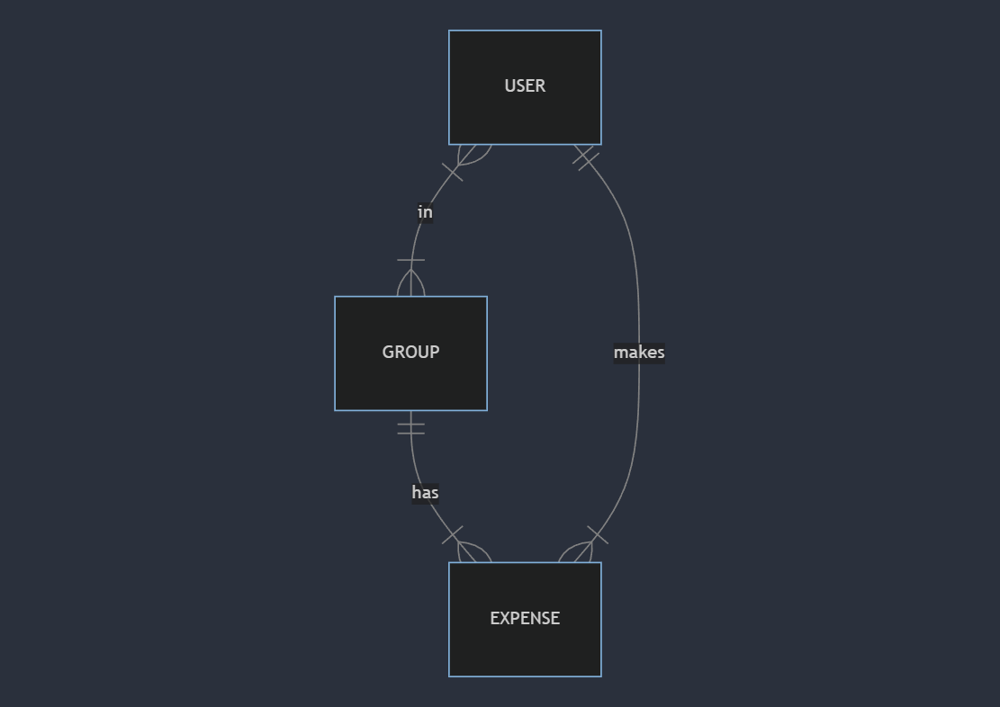

# Design Document

By Khalid Alansary

Video overview: https://youtu.be/j5q6bRWli_s

## Project idea

The idea is inspired from the app [splitwise](https://www.splitwise.com/) which allows friends to track money between them. The app will allow users to create groups and add friends to the group. The user can add expenses and the app will calculate how much each user should pay in each group to settle the debts.

## Scope

The database for the app includes all entities necessary to facilitate the process of tracking money between friends. As such, included in the database's scope is:

* Users, including basic identifying information
* Groups, including basic identifying information
* Expenses, including the amount of the expense, the time at which the expense was made, and the group to which the expense is related
* Balances, which is the amount each user owes or is owed in each group

## Functional Requirements

This database will support:

* CRUD operations for users and groups
* Tracking all expenses for each group
* Calculating how much each user should pay to settle the debts
* Having separate balances for each group

## Representation

Entities are captured in SQLite tables with the following schema.

### Entities

The database includes the following entities:

#### Users

The `users` table includes:

* `id`, which specifies the unique ID for the user as an `INTEGER`. This column thus has the `PRIMARY KEY` constraint applied.
* `username`, which specifies the user's username as `TEXT`. This column has the `UNIQUE` constraint applied to ensure no two users have the same username.

#### Groups
The `groups` table includes:

* `id`, which specifies the unique ID for the group as an `INTEGER`. This column thus has the `PRIMARY KEY` constraint applied.
* `name`, which specifies the group's name as `TEXT`. This column has the `UNIQUE` constraint applied to ensure no two groups have the same name.
* `number_of_members`, which specifies the number of members in the group as `INTEGER`.

#### Memberships

This table is a many-to-many relationship between users and groups. It represents each user's profile in each group.

The `memberships` table includes:

* `user_id`, which specifies the user's ID as an `INTEGER`. This column has the `FOREIGN KEY` constraint applied to reference the `id` column in the `users` table.
* `group_id`, which specifies the group's ID as an `INTEGER`. This column has the `FOREIGN KEY` constraint applied to reference the `id` column in the `groups` table.
* `balance`, which specifies the user's balance in the group as a `REAL`.

#### Expenses

The `expenses` table includes:

* `id`, which specifies the unique ID for the expense as an `INTEGER`. This column thus has the `PRIMARY KEY` constraint applied.
* `user_id`, which specifies the user's ID as an `INTEGER`. This column has the `FOREIGN KEY` constraint applied to reference the `id` column in the `users` table.
* `group_id`, which specifies the group's ID as an `INTEGER`. This column has the `FOREIGN KEY` constraint applied to reference the `id` column in the `groups` table.
* `amount`, which specifies the amount of the expense as a `REAL`.
* `description`, which specifies the description of the expense as a `TEXT`.
* `time`, which specifies the time at which the expense was made as a `NUMERIC`. The default value for the `time` attribute is the current timestamp, as denoted by `DEFAULT CURRENT_TIMESTAMP`.

### Relationships

The below entity relationship diagram describes the relationships among the entities in the database.

As detailed by the diagram:

* Each user can be a member of multiple groups, and each group can have multiple members. This is represented by the many-to-many relationship between users and groups, which is captured in the `memberships` table.
* Each user can make multiple expenses, and each expense is made by one user. This is represented by the one-to-many relationship between users and expenses.
* Each group can have multiple expenses, and each expense is related to one group. This is represented by the one-to-many relationship between groups and expenses.

## Optimizations

It is common that users are refrerenced by their username in the app. To optimize the database, indexes are added to the `username` column in the `users` table.

Similarly, the `name` column in the `groups` table is indexed to optimize the database.

It is also common that the app will need to query the `memberships` table to get the total balance for the user. To simplify this process, the `total_balances` view is created to calculate the total balance for each user.

To speed up the view `total_balances` and updating `balance`s in `memberships` table, the index `memberships_user_id_group_id` is created on the `user_id` and `group_id` columns in the `memberships` table. 

## Limitations

The current schema does not support the following features:

* The database does not handle user authentication. It is assumed that the app will handle user authentication and the database will only store the user's username.

* The app will not support debts outside groups. It is assumed that the user will only have debts within the groups.
